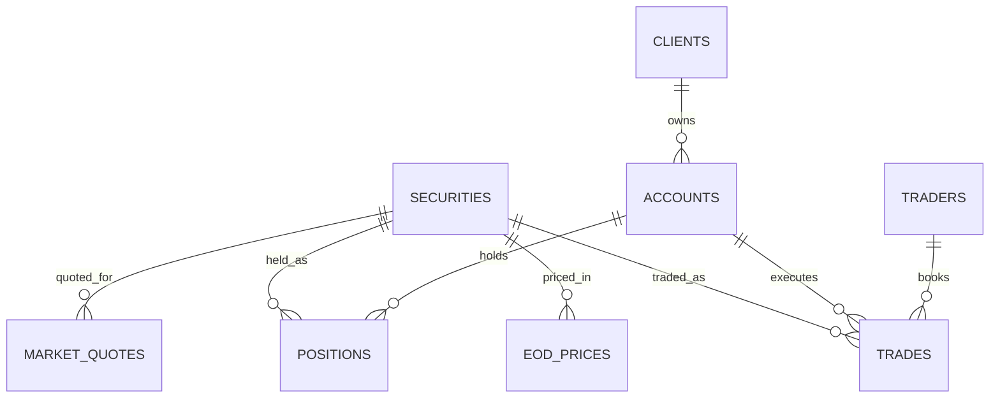

# Snowflake → Fabric OneLake Demo (Capital Markets / Trading)

End-to-end demo where:

- **Snowflake** owns the data and writes **Apache Iceberg** tables.
- The Iceberg files (Parquet + metadata) land **directly in Microsoft Fabric OneLake**.
- **Fabric Lakehouse** sees the tables immediately — **zero copy, zero ETL**.
- A **Fabric IQ ontology** is layered on top for Copilot Q&A.

```
┌────────────────────┐      writes Iceberg       ┌──────────────────────────────┐
│  Snowflake          │ ───────────────────────▶ │  Fabric OneLake               │
│  (managed Iceberg)  │   Parquet + metadata      │  Lakehouse / Files/iceberg    │
└────────────────────┘                            │  → auto-detected as tables    │
                                                   │  → Direct Lake / IQ / Spark   │
                                                   └──────────────────────────────┘
```

## What's in this Repo

| Path | Purpose |
|---|---|
| [`generate_data.py`](generate_data.py) | Synthetic capital-markets data generator (8 CSVs) |
| [`data/`](data/) | Pre-generated small-scale CSVs (~19 MB) |
| [`sql/snowflake/01_iceberg_schema_onelake.sql`](sql/snowflake/01_iceberg_schema_onelake.sql) | Snowflake setup + Iceberg table DDL writing to OneLake |
| [`sql/snowflake/02_load_data.sql`](sql/snowflake/02_load_data.sql) | PUT + COPY INTO scripts to load the demo CSVs |
| [`sql/snowflake/README.md`](sql/snowflake/README.md) | Step-by-step Snowflake setup guide |

## Schema

Tables (8): `securities`, `clients`, `accounts`, `traders`, `eod_prices`, `trades`, `market_quotes`, `positions`.

| Table | Type | Rows (small) |
|---|---|---|
| `securities` | dim | 100 |
| `clients` | dim | 1,000 |
| `accounts` | dim | 1,500 |
| `traders` | dim | 20 |
| `eod_prices` | fact | ~26K |
| `trades` | fact | 50,000 |
| `market_quotes` | fact (streaming) | 200,000 |
| `positions` | fact (snapshot) | ~10K |

### Entity Relationships



## Quick Start

### 1. Clone and (optionally) regenerate data

```powershell
git clone https://github.com/pratpat/Snowflake_Demo.git
cd Snowflake_Demo
python generate_data.py --scale small --out data       # already committed
# python generate_data.py --scale medium --out data    # ~400 MB
# python generate_data.py --scale large  --out data    # ~2 GB
```

### 2. Configure Snowflake → OneLake

Edit [`sql/snowflake/01_iceberg_schema_onelake.sql`](sql/snowflake/01_iceberg_schema_onelake.sql)
and replace placeholders:

| Placeholder | Example |
|---|---|
| `<workspace>` | your Fabric workspace name |
| `<lakehouse>` | your Lakehouse name (no `.Lakehouse` suffix) |
| `<entra-tenant-id>` | Microsoft Entra tenant GUID |
| `<warehouse>` | `FABRIC_WH` |
| `<your_user>` | your Snowflake login |

Run as `ACCOUNTADMIN`:

```bash
snowsql -a <account> -u <user> -r ACCOUNTADMIN -f sql/snowflake/01_iceberg_schema_onelake.sql
```

After `DESC EXTERNAL VOLUME onelake_capmkts;`:
1. Open the **AZURE_CONSENT_URL** → grant tenant-wide consent.
2. In the Fabric workspace **Manage access**, add the Snowflake Entra app
   (the name from `AZURE_MULTI_TENANT_APP_NAME`) as **Contributor**.

Verify:
```sql
SELECT SYSTEM$VERIFY_EXTERNAL_VOLUME('onelake_capmkts');
```

### 3. Load demo data

```bash
snowsql -a <account> -u <user> -r DATA_ENGINEER -w FABRIC_WH \
        -d CAPITAL_MARKETS -s PUBLIC -f sql/snowflake/02_load_data.sql
```

Snowflake writes Parquet + Iceberg metadata into:
```
azure://onelake.dfs.fabric.microsoft.com/<workspace>/<lakehouse>.Lakehouse/Files/iceberg/<table>/
```

### 4. See the data in Fabric

1. Open your Lakehouse → **Files → iceberg/** — you should see one folder per table.
2. Tables surface under **Tables** automatically (or create OneLake shortcuts to each Iceberg folder).
3. Query in a notebook:
   ```python
   spark.table("trades").groupBy("side").count().show()
   ```

## Prerequisites

| Area | Requirement |
|---|---|
| **Snowflake** | Standard or higher; Iceberg enabled (GA); `ACCOUNTADMIN` for one-time setup |
| **Fabric** | Workspace + Lakehouse; **Contributor** role for the Snowflake Entra app |
| **Identity** | Microsoft Entra tenant ID; consent for Snowflake's multi-tenant Entra app |
| **Network** | Snowflake → `onelake.dfs.fabric.microsoft.com` reachable (public; or PrivateLink + MPE for private) |

## How the Writes Work

| Step | Where it runs | What happens |
|---|---|---|
| `COPY INTO trades` | Snowflake compute | Reads CSV from internal stage |
| Iceberg write | Snowflake compute | Writes Parquet + Iceberg metadata to OneLake |
| Fabric reads | Fabric compute | Reads Parquet directly; **no Snowflake credits consumed** |

## Notes & Caveats

- Snowflake-managed Iceberg = **single writer** (Snowflake owns the table); Fabric is reader.
- OneLake is your storage; Snowflake just writes through to it.
- Schema evolution (`ALTER TABLE … ADD COLUMN`) flows through to Fabric.
- Snowflake row-access / masking policies do **not** propagate — re-implement in Fabric Lakehouse views or the Fabric IQ ontology layer.

## Related Repo

The synthetic dataset and Fabric ontology notebooks come from
[**fabric-capital-markets-demo**](https://github.com/pratpat/fabric-capital-markets-demo).

## License

[MIT](LICENSE)
